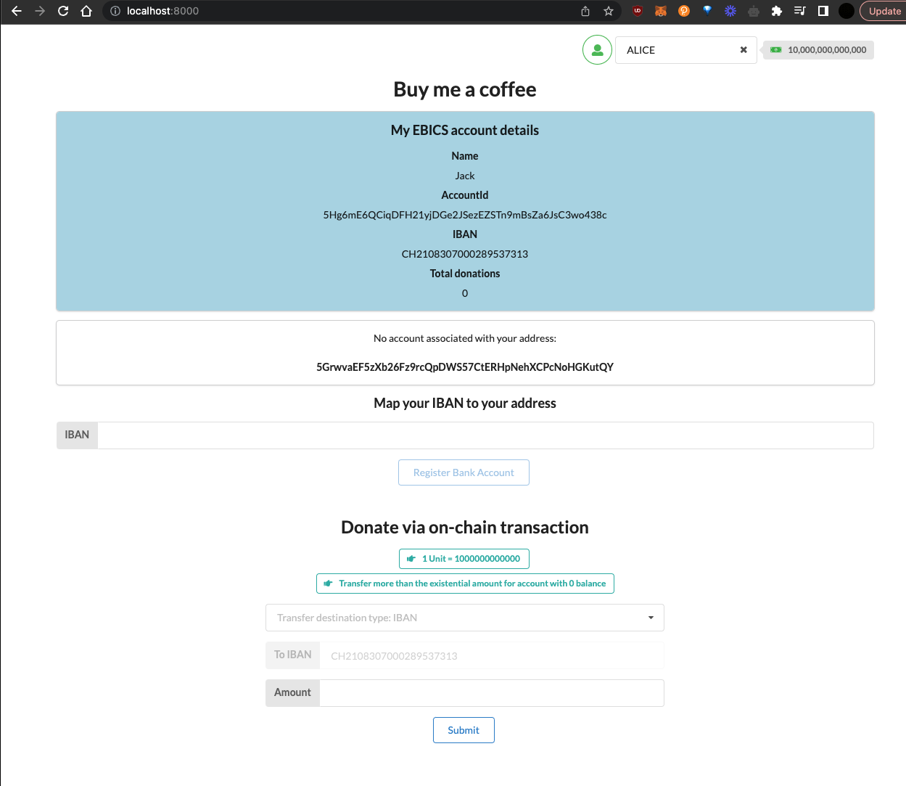
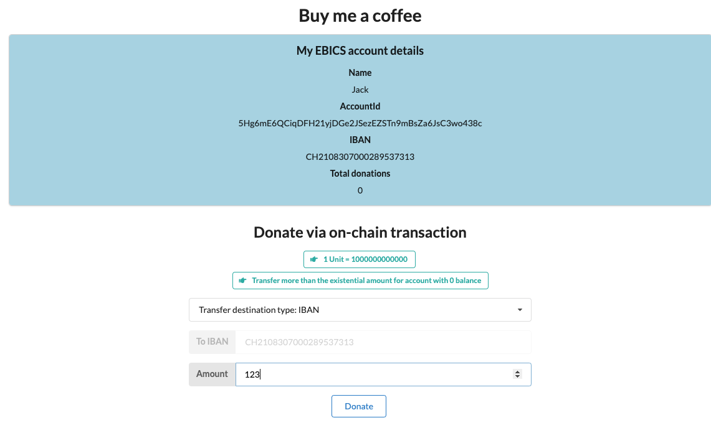
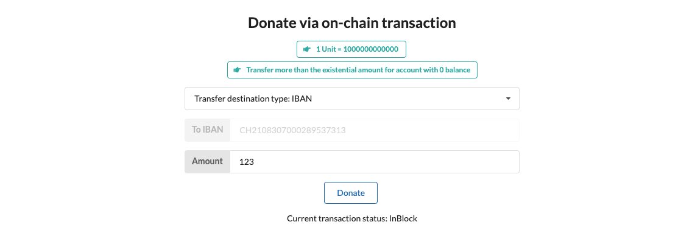
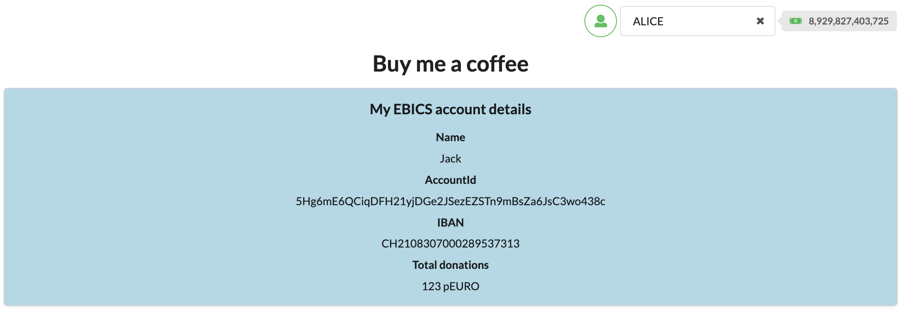
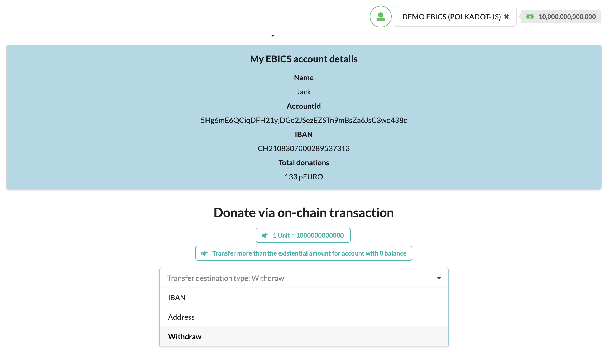
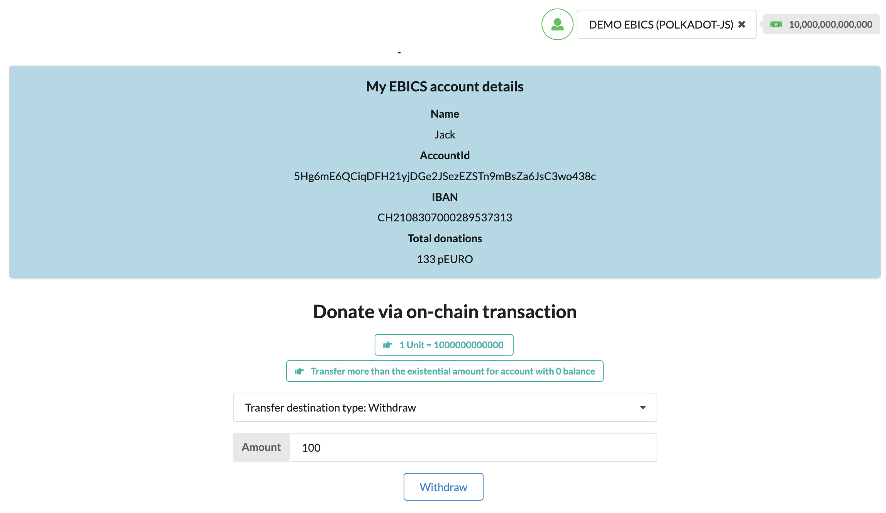

## EBICS fiat on/off-ramp demo

This project demonstrates a simple use case for EBICS fiat on/off-ramp chain. It is a simple Substrate chain that allows users to mint stablecoins by sending fiat to a bank account and burn stablecoins by sending them back to a bank account.

## Buy me a coffee

This demo is a decentralized application that allows users to buy someone a coffee or simply donate to support their cause. Users can donate by either sending stablecoins or fiat to the recipient's on-chain account or bank account (IBAN). The recipient can then withdraw the funds to their bank account or send them to someone else.

## Setup

### Chain

To get started, obviously make sure you have the necessary setup for Substrate development. Go through the main [README.md](../README.md) file to get started.

Start the chain in development mode with:
```bash
cargo run --release -- --dev --tmp
```

You also need to insert the keypair for our offchain worker, since it will be signing and submitting transactions to the chain. Open `Polkadot.js` [explorer](https://cloudflare-ipfs.com/ipns/dotapps.io/?rpc=ws%3A%2F%2F127.0.0.1%3A9944#/explorer) and choose `author -> insertKey` RPC call and fill out the fields with the following values:

```js
key_type: ramp
suri: cup swing hill dinner pioneer mom stick steel sad raven oak practice
public_key: 5C555czPfaHgYhKhsRg2KNCLGCJ82jVsvweTHAnfvT83uy5T
```

### Frontend

To run the website, go through it's [README.md](./README.md) file.

Start the frontend with:
```bash
yarn start
```

## Demo

Familiarize yourself with the [website](http://localhost:8000).



You can see on the top right corner that the current selected user is `Alice`. Our EBICS server that is deployed at http://w.e36.io:8093/ebics/api-v1, currently only supports three users: `Alice`, `Bob` and `Jack`. Jack is the user that will be receiving the donations.

Below is the mapping between the users and their bank accounts:

```json
{
[ 
    {
    "ownerName" : "Jack",
    "iban" : "CH2108307000289537313",
    "accountId": "5Hg6mE6QCiqDFH21yjDGe2JSezEZSTn9mBsZa6JsC3wo438c",
    "seed": "0x5108e950fb18a11a372da602c1714f289002204a8003748263bb9c351b57d3aa"
    },
    {
    "ownerName" : "Alice",
    "iban" : "CH2108307000289537320",
    "accountId": "5GrwvaEF5zXb26Fz9rcQpDWS57CtERHpNehXCPcNoHGKutQY",
  }, {
    "ownerName" : "Bob",
    "iban" : "CH1230116000289537312",
    "accountId": "5FHneW46xGXgs5mUiveU4sbTyGBzmstUspZC92UhjJM694ty",
  } ]
}
```

Note that `Jack` also has it's seed. You can use it to import Jack's account to `Polkadot.js` extension and sign transactions. For example, for withdrawing donations.

### Registering bank accounts

DApp detects whether current selected account has registered it's bank account on-chain. If it hasn't, it will force the user to map their on-chain account to their bank account.


Fill out `IBAN` field with the IBAN of `Alice` from the above mapping and click `Register Bank Account`.


### Donating to IBAN address

Now that Alice has mapped his on-chain account with her bank account, you should be able to see the form for submitting donations to Jack.



Note that the `IBAN` field is already filled out with Jack's IBAN and transfer destination type is `IBAN` by default. Enter the amount you want to donate and click `Donate`.

You can see the status of the transaction below the form.



It should take couple of minutes for chain and EBICS backend to process the transaction, and then you will see that the donation was successful.



### Donating to account

You can also donate to Jack's on-chain account. Select `Bob`'s wallet from the top right corner and select `Address` for transfer destination.


Similar to donating to IBAN, you can see the status of the transaction below the form. And once the transaction is processed, you will see that the total donations have increased.


### Withdrawing donations

Jack can withdraw donations to his bank account. To do that, you can select Jack's account from the top right corner, if you haven't added Jack's wallet to your `Polkadot.js` extension, please do it using the seed from the above mapping.



Once you have selected Jack's account, you can see that `Withdraw` is now available in transfer destination options. Select `Withdraw` and enter the amount you want to withdraw.



Once you click the `Withdraw` button, you will see the status of the transaction below the form. And once the transaction is processed, you will see that the total donations have decreased.


## Conclusion

This demo shows integration of EBICS fiat on/off-ramp into the Substrate chain. It also shows how to use the EBICS fiat on/off-ramp to build a decentralized application that allows users to donate to each other.
